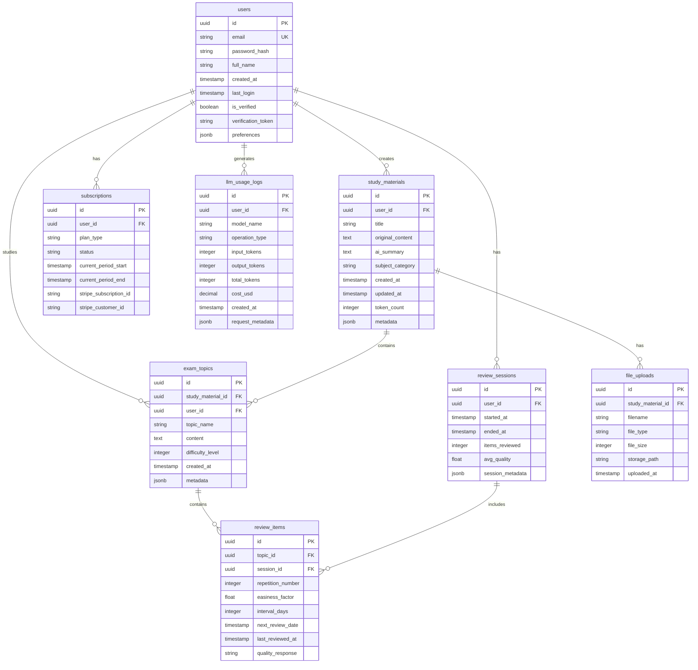

# Database Schema — ExamAI Pro

## Обзор

Схема базы данных ExamAI Pro спроектирована для поддержки адаптивной системы обучения с использованием алгоритма Spaced Repetition (SM-2), аналитики использования AI токенов, управления подписками и безопасного хранения пользовательских данных.

**Database:** PostgreSQL 15+  
**ORM:** SQLAlchemy 2.0+  
**Migrations:** Alembic

---

## Entity Relationship Diagram (Mermaid)



---

## Таблицы

### 1. `users` — Пользователи

Хранит информацию о зарегистрированных пользователях системы.

```sql
CREATE TABLE users (
    id UUID PRIMARY KEY DEFAULT gen_random_uuid(),
    email VARCHAR(255) UNIQUE NOT NULL,
    password_hash VARCHAR(255) NOT NULL,
    full_name VARCHAR(255),
    created_at TIMESTAMP WITH TIME ZONE DEFAULT NOW(),
    updated_at TIMESTAMP WITH TIME ZONE DEFAULT NOW(),
    last_login TIMESTAMP WITH TIME ZONE,
    is_verified BOOLEAN DEFAULT FALSE,
    verification_token VARCHAR(255),
    password_reset_token VARCHAR(255),
    password_reset_expires TIMESTAMP WITH TIME ZONE,
    role VARCHAR(50) DEFAULT 'student',  -- student, admin, moderator
    preferences JSONB DEFAULT '{}',  -- UI settings, notification preferences
    avatar_url VARCHAR(500),
    onboarding_completed BOOLEAN DEFAULT FALSE,
    deleted_at TIMESTAMP WITH TIME ZONE  -- Soft delete для GDPR compliance
);

CREATE INDEX idx_users_email ON users(email);
CREATE INDEX idx_users_verification_token ON users(verification_token) WHERE verification_token IS NOT NULL;
CREATE INDEX idx_users_created_at ON users(created_at);
CREATE INDEX idx_users_deleted_at ON users(deleted_at) WHERE deleted_at IS NULL;
```

**Поля:**
- `id` — UUID primary key
- `email` — уникальный email пользователя
- `password_hash` — bcrypt hash пароля
- `full_name` — полное имя
- `created_at/updated_at` — timestamps
- `is_verified` — подтверждён ли email
- `verification_token` — токен для подтверждения email
- `role` — роль пользователя (student, admin)
- `preferences` — JSON с настройками UI, языком, уведомлениями
- `onboarding_completed` — прошёл ли guided tour
- `deleted_at` — soft delete (GDPR right to be forgotten)

---

### 2. `subscriptions` — Подписки

Управление подписками и платежами через Stripe.

```sql
CREATE TABLE subscriptions (
    id UUID PRIMARY KEY DEFAULT gen_random_uuid(),
    user_id UUID NOT NULL REFERENCES users(id) ON DELETE CASCADE,
    plan_type VARCHAR(50) NOT NULL,  -- free, basic, pro, premium
    status VARCHAR(50) NOT NULL,  -- active, canceled, past_due, trialing
    current_period_start TIMESTAMP WITH TIME ZONE NOT NULL,
    current_period_end TIMESTAMP WITH TIME ZONE NOT NULL,
    cancel_at_period_end BOOLEAN DEFAULT FALSE,
    stripe_subscription_id VARCHAR(255) UNIQUE,
    stripe_customer_id VARCHAR(255),
    stripe_payment_method_id VARCHAR(255),
    trial_start TIMESTAMP WITH TIME ZONE,
    trial_end TIMESTAMP WITH TIME ZONE,
    created_at TIMESTAMP WITH TIME ZONE DEFAULT NOW(),
    updated_at TIMESTAMP WITH TIME ZONE DEFAULT NOW()
);

CREATE INDEX idx_subscriptions_user_id ON subscriptions(user_id);
CREATE INDEX idx_subscriptions_status ON subscriptions(status);
CREATE INDEX idx_subscriptions_stripe_subscription_id ON subscriptions(stripe_subscription_id);
CREATE INDEX idx_subscriptions_current_period_end ON subscriptions(current_period_end);
```

**Поля:**
- `plan_type` — тип подписки (free, basic, pro, premium)
- `status` — статус (active, canceled, past_due, trialing)
- `current_period_start/end` — текущий биллинговый период
- `stripe_subscription_id` — ID подписки в Stripe
- `cancel_at_period_end` — запланирована ли отмена

**Business Logic:**
- Free plan: ограничения на количество материалов/месяц
- Basic/Pro/Premium: см. `КОНЦЕПЦИЯ ПРОДУКТА.md` для pricing tiers

---

### 3. `study_materials` — Учебные материалы

Хранит загруженные файлы и сгенерированные AI конспекты.

```sql
CREATE TABLE study_materials (
    id UUID PRIMARY KEY DEFAULT gen_random_uuid(),
    user_id UUID NOT NULL REFERENCES users(id) ON DELETE CASCADE,
    title VARCHAR(500) NOT NULL,
    original_content TEXT,  -- Extracted text from file
    study_plan JSONB,  -- Topic structure (created immediately)
    ai_summary TEXT,  -- AI-generated summary (grows progressively as user studies)
    subject_category VARCHAR(100),  -- Math, Physics, History, etc.
    language VARCHAR(10) DEFAULT 'de',  -- de, en, ru
    source_type VARCHAR(50),  -- upload, paste, url
    created_at TIMESTAMP WITH TIME ZONE DEFAULT NOW(),
    updated_at TIMESTAMP WITH TIME ZONE DEFAULT NOW(),
    token_count INTEGER DEFAULT 0,  -- Tokens used for generation
    processing_status VARCHAR(50) DEFAULT 'pending',  -- pending, processing, completed, failed
    error_message TEXT,
    metadata JSONB DEFAULT '{}',  -- Page count, word count, complexity score
    deleted_at TIMESTAMP WITH TIME ZONE
);

CREATE INDEX idx_study_materials_user_id ON study_materials(user_id);
CREATE INDEX idx_study_materials_created_at ON study_materials(created_at);
CREATE INDEX idx_study_materials_subject_category ON study_materials(subject_category);
CREATE INDEX idx_study_materials_processing_status ON study_materials(processing_status);
CREATE INDEX idx_study_materials_deleted_at ON study_materials(deleted_at) WHERE deleted_at IS NULL;

-- Full-text search index для поиска по контенту
CREATE INDEX idx_study_materials_search ON study_materials 
    USING GIN(to_tsvector('german', title || ' ' || COALESCE(ai_summary, '')));
```

**Поля:**
- `original_content` — исходный текст из PDF/изображения/paste
- `study_plan` — JSON со структурой курса (создается сразу при загрузке)
- `ai_summary` — постепенно пополняемый конспект (добавляются темы по мере изучения)
- `subject_category` — предметная область
- `processing_status` — статус обработки плана (async job)
- `metadata` — JSON с дополнительной информацией (количество страниц, сложность, ключевые термины)

---

### 4. `file_uploads` — Загруженные файлы

Метаданные о загруженных файлах (PDF, изображения, DOCX).

```sql
CREATE TABLE file_uploads (
    id UUID PRIMARY KEY DEFAULT gen_random_uuid(),
    study_material_id UUID NOT NULL REFERENCES study_materials(id) ON DELETE CASCADE,
    filename VARCHAR(500) NOT NULL,
    file_type VARCHAR(50) NOT NULL,  -- pdf, jpg, png, docx
    file_size INTEGER NOT NULL,  -- bytes
    mime_type VARCHAR(100),
    storage_path VARCHAR(1000) NOT NULL,  -- S3/local path
    upload_url VARCHAR(1000),  -- Pre-signed URL для скачивания
    uploaded_at TIMESTAMP WITH TIME ZONE DEFAULT NOW(),
    checksum VARCHAR(64)  -- SHA256 для проверки целостности
);

CREATE INDEX idx_file_uploads_study_material_id ON file_uploads(study_material_id);
CREATE INDEX idx_file_uploads_uploaded_at ON file_uploads(uploaded_at);
```

**Storage Strategy:**
- Development: local filesystem (`/uploads/`)
- Production: AWS S3 или Cloudflare R2
- Max file size: 50MB (настраивается в config)

---

### 5. `exam_topics` — Темы для экзаменов

Темы, извлечённые из учебных материалов для повторения.

```sql
CREATE TABLE exam_topics (
    id UUID PRIMARY KEY DEFAULT gen_random_uuid(),
    study_material_id UUID NOT NULL REFERENCES study_materials(id) ON DELETE CASCADE,
    user_id UUID NOT NULL REFERENCES users(id) ON DELETE CASCADE,
    topic_name VARCHAR(500) NOT NULL,
    content TEXT NOT NULL,  -- Question or topic description
    content_markdown TEXT,  -- AI-generated summary for this specific topic (created on-demand)
    content_status VARCHAR(50) DEFAULT 'not_started',  -- not_started, generating, completed, failed
    answer TEXT,  -- AI-generated answer or explanation
    difficulty_level INTEGER DEFAULT 1,  -- 1-5 scale
    topic_type VARCHAR(50) DEFAULT 'concept',  -- concept, definition, formula, procedure
    created_at TIMESTAMP WITH TIME ZONE DEFAULT NOW(),
    updated_at TIMESTAMP WITH TIME ZONE DEFAULT NOW(),
    is_archived BOOLEAN DEFAULT FALSE,
    metadata JSONB DEFAULT '{}'  -- Tags, related topics, etc.
);

CREATE INDEX idx_exam_topics_study_material_id ON exam_topics(study_material_id);
CREATE INDEX idx_exam_topics_user_id ON exam_topics(user_id);
CREATE INDEX idx_exam_topics_created_at ON exam_topics(created_at);
CREATE INDEX idx_exam_topics_difficulty_level ON exam_topics(difficulty_level);
CREATE INDEX idx_exam_topics_is_archived ON exam_topics(is_archived) WHERE is_archived = FALSE;
```

**Поля:**
- `topic_name` — название темы/вопроса
- `content` — детальное описание темы
- `answer` — AI-сгенерированный ответ
- `difficulty_level` — уровень сложности (1-5)
- `topic_type` — тип (concept, definition, formula, procedure)

---

### 6. `review_items` — Элементы повторения (FSRS v4.5)

Реализация алгоритма Spaced Repetition (FSRS v4.5).

```sql
CREATE TABLE review_items (
    id UUID PRIMARY KEY DEFAULT gen_random_uuid(),
    topic_id UUID NOT NULL REFERENCES exam_topics(id) ON DELETE CASCADE,
    user_id UUID NOT NULL REFERENCES users(id) ON DELETE CASCADE,
    session_id UUID REFERENCES review_sessions(id) ON DELETE SET NULL,
    
    -- FSRS Algorithm fields
    stability DOUBLE PRECISION DEFAULT 0.0,      -- S: days to 90% retention
    difficulty DOUBLE PRECISION DEFAULT 0.0,     -- D: 0-10 scale
    elapsed_days INTEGER DEFAULT 0,              -- Days since last review
    scheduled_days INTEGER DEFAULT 0,            -- Scheduled interval
    reps INTEGER DEFAULT 0,                      -- Total review count
    lapses INTEGER DEFAULT 0,                    -- Number of failures
    state VARCHAR(20) DEFAULT 'new',             -- new, learning, review, relearning
    
    next_review_date TIMESTAMP WITH TIME ZONE DEFAULT NOW(),
    last_reviewed_at TIMESTAMP WITH TIME ZONE,
    
    -- User response tracking
    last_review_rating INTEGER,     -- 1=Again, 2=Hard, 3=Good, 4=Easy
    
    -- Metadata
    created_at TIMESTAMP WITH TIME ZONE DEFAULT NOW(),
    updated_at TIMESTAMP WITH TIME ZONE DEFAULT NOW(),
    
    CONSTRAINT check_fsrs_rating CHECK (last_review_rating >= 1 AND last_review_rating <= 4)
);

CREATE INDEX idx_review_items_topic_id ON review_items(topic_id);
CREATE INDEX idx_review_items_user_id ON review_items(user_id);
CREATE INDEX idx_review_items_session_id ON review_items(session_id);
CREATE INDEX idx_review_items_next_review_date ON review_items(next_review_date);
CREATE INDEX idx_review_items_user_next_review ON review_items(user_id, next_review_date);
```

**FSRS Algorithm Implementation:**

Алгоритм FSRS (Free Spaced Repetition Scheduler) v4.5 заменяет устаревший SM-2.
Основные параметры:
- **Stability (S)**: Интервал (в днях), при котором вероятность вспомнить материал составляет 90%.
- **Difficulty (D)**: Сложность материала от 0 до 10.
- **Retrievability (R)**: Вероятность успешного вспоминания в данный момент.

Рейтинги:
1. **Again** (Забыл) - сброс интервала, уменьшение стабильности.
2. **Hard** (Вспомнил с трудом) - меньший рост стабильности.
3. **Good** (Вспомнил) - стандартный рост стабильности.
4. **Easy** (Легко) - бонус к стабильности.

См. `backend/app/domain/review.py` для полной реализации формул.

---

### 7. `review_sessions` — Сессии повторения

Группирует review items в учебные сессии для аналитики.

```sql
CREATE TABLE review_sessions (
    id UUID PRIMARY KEY DEFAULT gen_random_uuid(),
    user_id UUID NOT NULL REFERENCES users(id) ON DELETE CASCADE,
    started_at TIMESTAMP WITH TIME ZONE DEFAULT NOW(),
    ended_at TIMESTAMP WITH TIME ZONE,
    items_reviewed INTEGER DEFAULT 0,
    items_correct INTEGER DEFAULT 0,
    avg_quality DECIMAL(3,2),  -- Average quality score
    total_duration_seconds INTEGER,  -- Session duration
    session_type VARCHAR(50) DEFAULT 'daily_review',  -- daily_review, cram_session, quiz
    session_metadata JSONB DEFAULT '{}'  -- Device, location, interruptions
);

CREATE INDEX idx_review_sessions_user_id ON review_sessions(user_id);
CREATE INDEX idx_review_sessions_started_at ON review_sessions(started_at);
CREATE INDEX idx_review_sessions_session_type ON review_sessions(session_type);
```

**Analytics:**
- Streak tracking (consecutive days)
- Best time of day for reviews
- Average session duration
- Completion rate

---

### 8. `llm_usage_logs` — Логи использования LLM

Детальное логирование всех вызовов LLM API для cost tracking и optimization.

```sql
CREATE TABLE llm_usage_logs (
    id UUID PRIMARY KEY DEFAULT gen_random_uuid(),
    user_id UUID REFERENCES users(id) ON DELETE SET NULL,
    study_material_id UUID REFERENCES study_materials(id) ON DELETE SET NULL,
    
    -- LLM details
    model_name VARCHAR(100) NOT NULL,  -- gemini-1.5-pro, gpt-4o, claude-3.5-sonnet
    provider VARCHAR(50) NOT NULL,  -- google, openai, anthropic
    operation_type VARCHAR(100) NOT NULL,  -- summarize, generate_topics, explain_concept
    
    -- Token usage
    input_tokens INTEGER NOT NULL,
    output_tokens INTEGER NOT NULL,
    total_tokens INTEGER GENERATED ALWAYS AS (input_tokens + output_tokens) STORED,
    
    -- Cost tracking
    cost_usd DECIMAL(10,6) NOT NULL,
    
    -- Performance metrics
    response_time_ms INTEGER,
    cache_hit BOOLEAN DEFAULT FALSE,
    
    -- Request context
    created_at TIMESTAMP WITH TIME ZONE DEFAULT NOW(),
    request_metadata JSONB DEFAULT '{}',  -- Prompt template version, temperature, etc.
    
    -- Error tracking
    error_occurred BOOLEAN DEFAULT FALSE,
    error_message TEXT
);

CREATE INDEX idx_llm_usage_logs_user_id ON llm_usage_logs(user_id);
CREATE INDEX idx_llm_usage_logs_created_at ON llm_usage_logs(created_at);
CREATE INDEX idx_llm_usage_logs_model_name ON llm_usage_logs(model_name);
CREATE INDEX idx_llm_usage_logs_operation_type ON llm_usage_logs(operation_type);

-- Materialized view для daily cost aggregation
CREATE MATERIALIZED VIEW daily_llm_costs AS
SELECT 
    DATE(created_at) as date,
    user_id,
    model_name,
    operation_type,
    SUM(total_tokens) as total_tokens,
    SUM(cost_usd) as total_cost_usd,
    COUNT(*) as request_count,
    AVG(response_time_ms) as avg_response_time_ms
FROM llm_usage_logs
WHERE error_occurred = FALSE
GROUP BY DATE(created_at), user_id, model_name, operation_type;

CREATE UNIQUE INDEX idx_daily_llm_costs ON daily_llm_costs(date, user_id, model_name, operation_type);
```

**Cost Control:**
- Monthly budget alerts per user (основано на subscription plan)
- Automatic downgrade к cheaper models при приближении к лимиту
- Caching frequently requested summaries

---

### 9. `api_keys` — API ключи (для API access)

Для future feature: programmatic access к ExamAI API.

```sql
CREATE TABLE api_keys (
    id UUID PRIMARY KEY DEFAULT gen_random_uuid(),
    user_id UUID NOT NULL REFERENCES users(id) ON DELETE CASCADE,
    key_hash VARCHAR(255) NOT NULL UNIQUE,  -- SHA256 hash
    key_prefix VARCHAR(20) NOT NULL,  -- First 8 chars for display
    name VARCHAR(255) NOT NULL,
    scopes TEXT[] DEFAULT '{}',  -- ['read:materials', 'write:materials']
    last_used_at TIMESTAMP WITH TIME ZONE,
    expires_at TIMESTAMP WITH TIME ZONE,
    is_active BOOLEAN DEFAULT TRUE,
    created_at TIMESTAMP WITH TIME ZONE DEFAULT NOW(),
    revoked_at TIMESTAMP WITH TIME ZONE
);

CREATE INDEX idx_api_keys_user_id ON api_keys(user_id);
CREATE INDEX idx_api_keys_key_hash ON api_keys(key_hash);
CREATE INDEX idx_api_keys_is_active ON api_keys(is_active) WHERE is_active = TRUE;
```

---

### 10. `audit_logs` — Audit trail

Для compliance и security (GDPR Article 30 — Record of Processing Activities).

```sql
CREATE TABLE audit_logs (
    id UUID PRIMARY KEY DEFAULT gen_random_uuid(),
    user_id UUID REFERENCES users(id) ON DELETE SET NULL,
    action VARCHAR(100) NOT NULL,  -- login, logout, create_material, delete_account
    resource_type VARCHAR(50),  -- user, study_material, subscription
    resource_id UUID,
    ip_address INET,
    user_agent TEXT,
    request_id UUID,  -- Correlation ID для distributed tracing
    created_at TIMESTAMP WITH TIME ZONE DEFAULT NOW(),
    metadata JSONB DEFAULT '{}'
);

CREATE INDEX idx_audit_logs_user_id ON audit_logs(user_id);
CREATE INDEX idx_audit_logs_created_at ON audit_logs(created_at);
CREATE INDEX idx_audit_logs_action ON audit_logs(action);
CREATE INDEX idx_audit_logs_resource ON audit_logs(resource_type, resource_id);

-- Partition по месяцам для performance
CREATE TABLE audit_logs_2025_11 PARTITION OF audit_logs
    FOR VALUES FROM ('2025-11-01') TO ('2025-12-01');
```

---

## Indexes Strategy

### Performance Optimization

**Composite Indexes для частых queries:**

```sql
-- Получение материалов пользователя, отсортированных по дате
CREATE INDEX idx_study_materials_user_created ON study_materials(user_id, created_at DESC);

-- Получение review items для сегодняшнего повторения
CREATE INDEX idx_review_items_due_today ON review_items(user_id, next_review_date) 
    WHERE next_review_date <= NOW();

-- Подсчёт токенов по пользователю за период
CREATE INDEX idx_llm_usage_date_user ON llm_usage_logs(created_at, user_id, total_tokens);
```

### Partial Indexes для фильтрации

```sql
-- Только активные подписки
CREATE INDEX idx_active_subscriptions ON subscriptions(user_id) 
    WHERE status = 'active';

-- Только не удалённые материалы
CREATE INDEX idx_active_study_materials ON study_materials(user_id) 
    WHERE deleted_at IS NULL;
```

---

## Data Retention & GDPR Compliance

### Soft Delete Strategy

Все user-facing таблицы используют `deleted_at` для soft delete:

```sql
-- Вместо DELETE используем UPDATE
UPDATE users SET deleted_at = NOW() WHERE id = 'user-uuid';

-- Queries всегда фильтруют deleted_at IS NULL
SELECT * FROM study_materials WHERE user_id = 'uuid' AND deleted_at IS NULL;
```

### Hard Delete Schedule

```sql
-- Cron job для очистки старых данных (после 90 дней)
DELETE FROM users WHERE deleted_at < NOW() - INTERVAL '90 days';
DELETE FROM audit_logs WHERE created_at < NOW() - INTERVAL '2 years';
```

### GDPR Right to be Forgotten

```python
# Процедура полного удаления пользователя
def gdpr_delete_user(user_id: UUID):
    # 1. Soft delete user
    user.deleted_at = datetime.now()
    
    # 2. Anonymize audit logs
    db.execute(
        "UPDATE audit_logs SET user_id = NULL, metadata = '{}' WHERE user_id = :uid",
        uid=user_id
    )
    
    # 3. Delete subscription in Stripe
    stripe.Subscription.delete(user.subscription.stripe_subscription_id)
    
    # 4. Schedule hard delete in 90 days
    # (позволяет восстановить аккаунт при ошибочном удалении)
```

---

## Migration Strategy

### Alembic Setup

```bash
# Инициализация
alembic init alembic

# Создание миграции
alembic revision --autogenerate -m "Create initial schema"

# Применение миграций
alembic upgrade head

# Rollback
alembic downgrade -1
```

### Migration Best Practices

1. **Backwards Compatible Changes**
   - Добавление nullable columns
   - Создание новых таблиц
   - Добавление indexes (с `CONCURRENTLY` в production)

2. **Breaking Changes (требуют downtime)**
   - Dropping columns
   - Changing data types
   - Adding NOT NULL constraints

3. **Zero-Downtime Migrations**
   ```sql
   -- Вместо ALTER TABLE ADD COLUMN ... NOT NULL
   
   -- Step 1: Add nullable column
   ALTER TABLE users ADD COLUMN new_field VARCHAR(255);
   
   -- Step 2: Backfill data (в background job)
   UPDATE users SET new_field = 'default_value' WHERE new_field IS NULL;
   
   -- Step 3: Add NOT NULL constraint
   ALTER TABLE users ALTER COLUMN new_field SET NOT NULL;
   ```

### Seed Data для Development

```sql
-- seeds/dev_data.sql
INSERT INTO users (id, email, password_hash, full_name, is_verified, role) VALUES
    ('00000000-0000-0000-0000-000000000001', 'admin@examai.com', '$2b$12$...', 'Admin User', TRUE, 'admin'),
    ('00000000-0000-0000-0000-000000000002', 'test@student.com', '$2b$12$...', 'Test Student', TRUE, 'student');

INSERT INTO subscriptions (user_id, plan_type, status, current_period_start, current_period_end) VALUES
    ('00000000-0000-0000-0000-000000000002', 'pro', 'active', NOW(), NOW() + INTERVAL '1 month');
```

---

## Backup & Disaster Recovery

### Backup Strategy

```bash
# Daily full backup (automated)
pg_dump -Fc examai_production > backups/examai_$(date +%Y%m%d).dump

# Restore
pg_restore -d examai_production backups/examai_20251118.dump
```

**Backup Schedule:**
- **Full backups:** Daily at 3 AM UTC
- **Incremental backups:** Every 6 hours (WAL archiving)
- **Retention:** 30 daily, 12 weekly, 12 monthly

### Point-in-Time Recovery (PITR)

```sql
-- Enable WAL archiving
archive_mode = on
archive_command = 'cp %p /backups/wal_archive/%f'
wal_level = replica
```

**Recovery Time Objective (RTO):** < 1 hour  
**Recovery Point Objective (RPO):** < 1 hour

---

## Performance Considerations

### Query Optimization

```sql
-- Use EXPLAIN ANALYZE для анализа
EXPLAIN ANALYZE
SELECT sm.title, COUNT(et.id) as topic_count
FROM study_materials sm
LEFT JOIN exam_topics et ON et.study_material_id = sm.id
WHERE sm.user_id = 'user-uuid' AND sm.deleted_at IS NULL
GROUP BY sm.id
ORDER BY sm.created_at DESC
LIMIT 20;
```

### Connection Pooling

```python
# SQLAlchemy engine configuration
engine = create_engine(
    DATABASE_URL,
    pool_size=20,  # Max connections
    max_overflow=10,  # Extra connections under load
    pool_pre_ping=True,  # Verify connection health
    pool_recycle=3600  # Recycle connections every hour
)
```

### Caching Strategy

**Redis caching для:**
- User session data (TTL: 24 hours)
- Active subscription status (TTL: 1 hour)
- Daily review items (TTL: 1 hour)
- LLM responses для identical requests (TTL: 7 days)

```python
# Example caching pattern
@cached(ttl=3600, key="user:{user_id}:review_items:due")
def get_due_review_items(user_id: UUID) -> List[ReviewItem]:
    return db.query(ReviewItem).filter(
        ReviewItem.user_id == user_id,
        ReviewItem.next_review_date <= datetime.now()
    ).all()
```

---

## Monitoring & Alerting

### Database Metrics

**Monitor:**
- Connection pool utilization (alert if > 80%)
- Slow query log (queries > 1 second)
- Index hit ratio (target: > 99%)
- Table bloat (vacuum statistics)
- Replication lag (if using replicas)

### PostgreSQL Extensions

```sql
-- Query performance insights
CREATE EXTENSION pg_stat_statements;

-- Full-text search
CREATE EXTENSION pg_trgm;

-- UUID generation
CREATE EXTENSION pgcrypto;
```

---

## Security Considerations

### Row-Level Security (RLS)

```sql
-- Enable RLS на всех user-facing таблицах
ALTER TABLE study_materials ENABLE ROW LEVEL SECURITY;

-- Policy: users can only see their own materials
CREATE POLICY study_materials_isolation ON study_materials
    USING (user_id = current_setting('app.current_user_id')::UUID);

-- Set user context в application code
SET LOCAL app.current_user_id = 'user-uuid';
```

### Encryption

- **At rest:** PostgreSQL TDE (Transparent Data Encryption) или disk-level encryption
- **In transit:** SSL/TLS для всех database connections
- **Sensitive fields:** `password_hash` хранится с bcrypt (work factor: 12)

### SQL Injection Prevention

**SQLAlchemy ORM автоматически использует parameterized queries:**

```python
# ✅ SAFE
db.query(User).filter(User.email == user_input).first()

# ❌ DANGEROUS (never do this)
db.execute(f"SELECT * FROM users WHERE email = '{user_input}'")
```

---

## Database Size Estimates

**Assumptions:**
- 10,000 users
- Average 20 study materials per user
- Average 50 topics per material
- 1 year of operation

| Table | Rows | Row Size | Total Size |
|-------|------|----------|------------|
| users | 10,000 | 1 KB | 10 MB |
| subscriptions | 10,000 | 0.5 KB | 5 MB |
| study_materials | 200,000 | 50 KB | 10 GB |
| exam_topics | 10,000,000 | 5 KB | 50 GB |
| review_items | 20,000,000 | 1 KB | 20 GB |
| review_sessions | 1,000,000 | 0.5 KB | 500 MB |
| llm_usage_logs | 500,000 | 1 KB | 500 MB |
| audit_logs | 5,000,000 | 1 KB | 5 GB |
| **TOTAL** | | | **~86 GB** |

**Scaling Plan:**
- До 100K users: Single PostgreSQL instance (vertically scale)
- 100K - 1M users: Read replicas + connection pooling (PgBouncer)
- 1M+ users: Sharding по user_id или region

---

## Next Steps

1. ✅ Review и approve схему
2. ⬜ Создать Alembic migrations
3. ⬜ Написать SQLAlchemy models (см. `Architektur.md`)
4. ⬜ Настроить CI/CD для автоматических миграций
5. ⬜ Создать seed data для development
6. ⬜ Настроить automated backups
7. ⬜ Implement monitoring (pg_stat_statements)

---

## References

- [PostgreSQL Documentation](https://www.postgresql.org/docs/)
- [SQLAlchemy 2.0 Documentation](https://docs.sqlalchemy.org/)
- [Alembic Tutorial](https://alembic.sqlalchemy.org/en/latest/tutorial.html)
- [SM-2 Algorithm](https://www.supermemo.com/en/archives1990-2015/english/ol/sm2)
- [GDPR Data Protection](https://gdpr-info.eu/)
