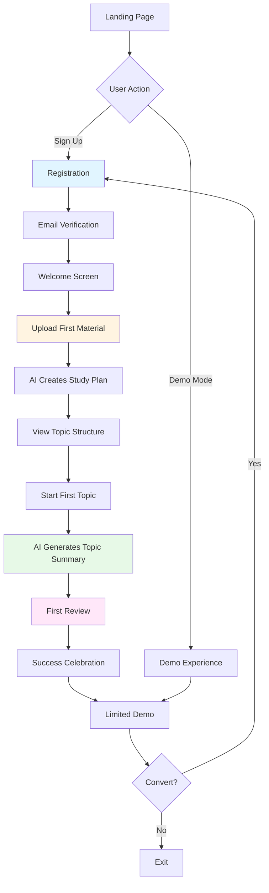

# User Onboarding — ExamAI Pro

## Цель Onboarding

Провести нового пользователя от регистрации до успешного создания **плана обучения** и **первого конспекта темы** за **максимум 5 минут**, минимизируя drop-off rate на каждом этапе.

**Success Metrics:**
- Completion rate > 70%
- Time to first value (TTFV) < 5 minutes
- Day 1 retention > 60%
- Day 7 retention > 40%

---

## User Journey Overview



---

## Phase 1: Pre-Registration (Landing Page)

### Objective
Объяснить value proposition и мотивировать регистрацию.

### Key Elements

**Hero Section:**
```
Headline: "Von Skript zu Konspekt in Sekunden – KI-gestützt lernen"
Subheadline: "Lade deine Unterlagen hoch, erhalte perfekte Zusammenfassungen 
              und wiederhole mit wissenschaftlich bewährten Methoden."

CTA: [Kostenlos starten] [Demo ansehen]
```

**Social Proof:**
- "Bereits 10.000+ Studenten lernen mit ExamAI"
- User testimonials с фото
- University logos (wenn разрешено)

**Demo Mode CTA:**
```
"Keine Lust auf Anmeldung? → [Probiere die Demo (ohne Registrierung)]"
```

### Demo Mode Flow

**Без регистрации:**
1. Пользователь попадает на pre-loaded demo материал
2. Видит готовый AI summary
3. Может попробовать 3 review questions
4. После 3 вопросов → "Sign up to continue"

**Ограничения Demo:**
- Нельзя загрузить свой файл
- Нельзя сохранить прогресс
- Нельзя создать topics

**Conversion Prompt:**
```
"👋 Du bist 70% durch! Registriere dich kostenlos, um:
✓ Deine eigenen Materialien hochzuladen
✓ Unbegrenzte AI-Zusammenfassungen zu erhalten
✓ Deinen Lernfortschritt zu speichern

[Kostenlos registrieren (30 Sekunden)]"
```

---

## Phase 2: Registration & Email Verification

### Objective
Максимально упростить регистрацию, минимизировать friction.

### Registration Form

**Fields:**
```
Email:          [________________]
Passwort:       [________________] (mit strength indicator)
Vorname:        [________________] (optional)

[✓] Ich akzeptiere die AGB und Datenschutzerklärung

[Kostenlos registrieren]

Bereits ein Konto? [Anmelden]
```

**Social Login (опционально, Phase 2+):**
```
[Weiter mit Google] [Weiter mit Microsoft]
```

### Validation Rules

- **Email:** Valid format, unique, не одноразовый (disposable email detection)
- **Password:** Минимум 8 символов, 1 uppercase, 1 number
- **Realtime validation** с green checkmarks

### Email Verification

**Immediate после регистрации:**

```
✉️ Bestätigungsmail gesendet!

Wir haben eine E-Mail an student@university.edu gesendet.
Klicke auf den Link, um dein Konto zu aktivieren.

[E-Mail nicht erhalten? → Erneut senden]
```

**Email Template:**

```
Subject: Willkommen bei ExamAI – Bestätige deine E-Mail ✨

Hallo Anna,

Willkommen bei ExamAI! Du bist nur einen Klick entfernt.

[Konto aktivieren] <-- Big CTA button

Dieser Link ist 24 Stunden gültig.

Falls du dich nicht registriert hast, ignoriere diese E-Mail.

Viel Erfolg beim Lernen!
Das ExamAI Team

P.S. Nach der Aktivierung kannst du sofort loslegen – 
keine Kreditkarte erforderlich!
```

### Post-Verification Redirect

```
→ /onboarding/welcome
```

---

## Phase 3: Welcome & Goal Setting

### Objective
Персонализировать опыт, понять цели пользователя.

### Welcome Screen

```
┌─────────────────────────────────────────┐
│  👋 Willkommen, Anna!                   │
│                                         │
│  Lass uns ExamAI für dich einrichten.  │
│  Das dauert nur 2 Minuten.             │
│                                         │
│  [Los geht's] →                        │
└─────────────────────────────────────────┘

Progress: ●○○○○ (Step 1 of 5)
```

### Step 1: Study Level

```
Für welches Niveau lernst du hauptsächlich?

○ Abitur / Matura
○ Bachelor
○ Master
○ Weiterbildung / Andere

[Weiter] →

Progress: ●●○○○ (Step 2 of 5)
```

### Step 2: Primary Subjects

```
Welche Fächer studierst du? (Mehrfachauswahl)

☑ Mathematik
☑ Physik
□ Chemie
□ Biologie
□ Informatik
□ Geschichte
□ ... (weitere 20+ Optionen)

[Weiter] →

Progress: ●●●○○ (Step 3 of 5)
```

### Step 3: Learning Goal

```
Was ist dein Hauptziel?

○ Prüfungsvorbereitung
○ Vorlesungen nacharbeiten
○ Langfristiges Lernen
○ Einfach ausprobieren

[Weiter] →

Progress: ●●●●○ (Step 4 of 5)
```

### Step 4: Notification Preferences

```
Wie möchtest du an Wiederholungen erinnert werden?

☑ E-Mail (täglich)
□ Push-Benachrichtigungen
□ Keine Erinnerungen

[Weiter] →

Progress: ●●●●● (Step 5 of 5)
```

**Stored in:** `users.preferences` JSONB field

---

## Phase 4: Upload First Material (Critical!)

### Objective
**TTFV Moment:** Пользователь получает первую ценность (AI summary).

### Empty State

```
┌─────────────────────────────────────────────────┐
│  📚 Dein erstes Lernmaterial hochladen          │
│                                                 │
│  Lade ein PDF, Bild oder Dokument hoch und     │
│  erhalte in Sekunden eine AI-Zusammenfassung.  │
│                                                 │
│  ┌───────────────────────────────────────────┐ │
│  │  📎 Datei hierher ziehen                  │ │
│  │     oder                                  │ │
│  │  [Datei auswählen]                        │ │
│  │                                           │ │
│  │  Unterstützt: PDF, JPG, PNG, DOCX        │ │
│  │  Max. Größe: 50 MB                        │ │
│  └───────────────────────────────────────────┘ │
│                                                 │
│  Oder:                                          │
│  [📝 Text einfügen]  [🔗 Von URL importieren]  │
│                                                 │
│  💡 Tipp: Je klarer deine Unterlagen, desto    │
│     besser die AI-Zusammenfassung!             │
│                                                 │
│  [Demo-Material ausprobieren] (skip)           │
└─────────────────────────────────────────────────┘
```

### Upload Options

**1. File Upload (Drag & Drop)**
- Instant preview после выбора файла
- Progress bar во время upload
- Thumbnail preview для PDF

**2. Text Paste**
```
┌─────────────────────────────────────────┐
│  Text einfügen                          │
│  ┌───────────────────────────────────┐  │
│  │                                   │  │
│  │  Füge hier deinen Text ein...    │  │
│  │  (z.B. Vorlesungsnotizen)        │  │
│  │                                   │  │
│  └───────────────────────────────────┘  │
│                                         │
│  Titel: [___________________________]  │
│  Fach:  [Mathematik ▾]                 │
│                                         │
│  [Zusammenfassung erstellen] →         │
└─────────────────────────────────────────┘
```

**3. URL Import (Future)**
```
URL: [https://wikipedia.org/article...]
[Importieren]
```

### Skip Option (Demo Material)

```
"Noch keine Unterlagen zur Hand?"
[Probiere unser Demo-Material aus]

→ Loads pre-made "Integralrechnung" PDF
```

**Why Skip is OK:**
- Пользователь всё равно видит value (AI summary)
- Можно вернуться и загрузить свой материал позже

---

## Phase 5: AI Creates Study Plan

### Objective
Создать anticipation, показать AI "в работе", быстро сгенерировать план обучения (список тем).

### Processing Screen

```
┌─────────────────────────────────────────┐
│  ⚡ AI analysiert dein Material...      │
│                                         │
│  [████████████████████] 85%            │
│                                         │
│  ✓ Text extrahiert                     │
│  ✓ Struktur erkannt                    │
│  ⏳ Themenplan wird erstellt...        │
│                                         │
│  Geschätzte Zeit: ~15 Sekunden         │
│                                         │
│  💡 Wusstest du?                        │
│  ExamAI erstellt zuerst einen Plan,     │
│  dann Zusammenfassungen nur für die     │
│  Themen, die du gerade lernst.          │
└─────────────────────────────────────────┘
```

**Real-time Updates (WebSocket):**
- Progress bar обновляется каждые 5%
- Checkmarks появляются по мере completion
- "Did you know" tips меняются каждые 10 секунд

**Tips Rotation:**
1. "ExamAI nutzt Spaced Repetition – die effektivste Lernmethode."
2. "Studien zeigen: Aktive Wiederholung verdoppelt die Behaltensrate."
3. "Unsere AI basiert auf Google Gemini – dem fortschrittlichsten Sprachmodell."

### Error Handling

**Если processing failed:**

```
┌─────────────────────────────────────────┐
│  ⚠️ Ups, etwas ist schiefgelaufen       │
│                                         │
│  Wir konnten dein Material nicht        │
│  verarbeiten.                           │
│                                         │
│  Mögliche Gründe:                       │
│  • Datei ist beschädigt                 │
│  • Text ist nicht lesbar (zu viele      │
│    Handschriften/Formeln)               │
│                                         │
│  [Anderes Material hochladen]           │
│  [Demo-Material ausprobieren]           │
│                                         │
│  Brauchst du Hilfe? [Support →]        │
└─────────────────────────────────────────┘
```

**Auto-retry (silent):**
- 1 retry при network error
- Fallback на gemini-1.5-flash если pro timeout

---

## Phase 6: First AI Summary (Value Delivery!)

### Objective
**Wow Moment!** Пользователь видит результат и понимает ценность продукта.

### Summary View

```
┌─────────────────────────────────────────────────┐
│  ✨ Deine Zusammenfassung ist fertig!           │
│                                                 │
│  📄 Mathematik Kapitel 5: Integralrechnung     │
│  📅 Erstellt: 18.11.2025, 12:30                │
│  📊 15 Seiten → 3 Seiten Zusammenfassung       │
│                                                 │
├─────────────────────────────────────────────────┤
│                                                 │
│  # Integralrechnung                            │
│                                                 │
│  ## Stammfunktionen                            │
│  Die Stammfunktion F(x) einer Funktion f(x)   │
│  ist die Funktion, deren Ableitung f(x) ist:  │
│  F'(x) = f(x)                                  │
│                                                 │
│  **Beispiel:**                                 │
│  f(x) = 3x²                                    │
│  F(x) = x³ + C (C = Integrationskonstante)    │
│                                                 │
│  ## Bestimmtes Integral                        │
│  ∫[a,b] f(x)dx = F(b) - F(a)                  │
│  ...                                           │
│                                                 │
│  [Weiterlesen ↓]                               │
│                                                 │
├─────────────────────────────────────────────────┤
│  [✏️ Bearbeiten] [💾 Herunterladen]            │
│  [🎯 Lernthemen erstellen →]                   │
└─────────────────────────────────────────────────┘
```

**Tooltip on "Lernthemen erstellen":**
```
"Erstelle Fragen und Karteikarten aus dieser 
Zusammenfassung für effektives Wiederholen!"
```

### Celebration Animation

```
┌─────────────────────────────────┐
│         🎉                      │
│    Geschafft!                   │
│                                 │
│  Du hast deinen ersten          │
│  AI-Konspekt erstellt!          │
│                                 │
│  [Lernthemen erstellen] →      │
└─────────────────────────────────┘
```

**Auto-dismiss:** 3 секунды

---

## Phase 7: Generate Topics for Review

### Objective
Переход к core feature — spaced repetition system.

### Topics Generation Prompt

```
┌─────────────────────────────────────────┐
│  🎯 Lernthemen erstellen                │
│                                         │
│  Wir erstellen jetzt Fragen und        │
│  Karteikarten aus deiner Zusammen-     │
│  fassung, damit du effektiv wiederholen │
│  kannst.                                │
│                                         │
│  Wie viele Themen möchtest du?         │
│                                         │
│  ○ Wenige (5-10) – Schneller Überblick │
│  ● Mittel (10-20) – Empfohlen          │
│  ○ Viele (20-50) – Detailliert         │
│                                         │
│  [Themen generieren] →                 │
│                                         │
│  ⏱️ Dauert ca. 10 Sekunden             │
└─────────────────────────────────────────┘
```

### Processing

```
┌─────────────────────────────────────────┐
│  ⚡ Generiere Lernthemen...             │
│                                         │
│  [████████████████] 100%               │
│                                         │
│  ✓ 15 Themen erstellt                  │
│                                         │
│  [Themen ansehen] →                    │
└─────────────────────────────────────────┘
```

### Topics Preview

```
┌─────────────────────────────────────────────────┐
│  📚 Deine Lernthemen (15)                       │
│                                                 │
│  ┌───────────────────────────────────────────┐ │
│  │ 1. Stammfunktion berechnen           [●●○] │ │
│  │    Was ist die Stammfunktion von 3x²?     │ │
│  │    → Wiederholung in: 1 Tag               │ │
│  └───────────────────────────────────────────┘ │
│                                                 │
│  ┌───────────────────────────────────────────┐ │
│  │ 2. Bestimmtes Integral                [●○○] │ │
│  │    Wie berechnet man ∫[0,2] x² dx?        │ │
│  │    → Wiederholung in: 1 Tag               │ │
│  └───────────────────────────────────────────┘ │
│                                                 │
│  ... 13 weitere Themen                         │
│                                                 │
│  [Jetzt wiederholen] →                         │
│  [Später]                                       │
└─────────────────────────────────────────────────┘
```

**Difficulty Indicator:**
- ●●○ = Medium difficulty
- ●○○ = Easy
- ●●● = Hard

---

## Phase 8: First Review Session (Habit Formation)

### Objective
**Critical!** Пользователь должен попробовать review систему, чтобы понять loop.

### Review Intro

```
┌─────────────────────────────────────────┐
│  🎓 Deine erste Wiederholungssession    │
│                                         │
│  So funktioniert's:                     │
│                                         │
│  1️⃣ Wir zeigen dir eine Frage          │
│  2️⃣ Versuche, sie zu beantworten       │
│  3️⃣ Bewerte, wie gut du sie wusstest   │
│  4️⃣ Wir planen automatisch die         │
│      nächste Wiederholung ein           │
│                                         │
│  📊 Heute: 15 Themen                   │
│  ⏱️ Geschätzte Zeit: 8 Minuten         │
│                                         │
│  [Session starten] →                   │
└─────────────────────────────────────────┘
```

### Review Card Interface

```
┌─────────────────────────────────────────────────┐
│  Frage 1 von 15                        [X]      │
│                                                 │
│  📝 Stammfunktion berechnen                    │
│                                                 │
│  Was ist die Stammfunktion von f(x) = 3x²?    │
│                                                 │
│                                                 │
│  [Antwort zeigen] →                            │
│                                                 │
│                                                 │
│  💡 Tipp: Versuche, die Antwort zuerst         │
│     im Kopf zu formulieren!                    │
└─────────────────────────────────────────────────┘
```

**Nach Klик "Antwort zeigen":**

```
┌─────────────────────────────────────────────────┐
│  Frage 1 von 15                        [X]      │
│                                                 │
│  📝 Stammfunktion berechnen                    │
│                                                 │
│  Was ist die Stammfunktion von f(x) = 3x²?    │
│                                                 │
│  ✅ Antwort:                                   │
│  F(x) = x³ + C                                 │
│                                                 │
│  (wobei C die Integrationskonstante ist)       │
│                                                 │
│  Wie gut konntest du die Antwort?              │
│                                                 │
│  [😰 Keine Ahnung]                             │
│  [🤔 Schwierig]                                │
│  [😊 Mit Mühe]                                 │
│  [😎 Einfach]                                  │
│  [🎯 Perfekt]                                  │
│                                                 │
│  (Deine Bewertung bestimmt, wann du diese      │
│   Frage wieder siehst)                         │
└─────────────────────────────────────────────────┘
```

**Quality Mapping to SM-2:**
- 😰 Keine Ahnung → Quality 0
- 🤔 Schwierig → Quality 2
- 😊 Mit Mühe → Quality 3
- 😎 Einfach → Quality 4
- 🎯 Perfekt → Quality 5

### Progress Indicator

```
┌─────────────────────────────────────────┐
│  [████████████░░░░░░░░░] 60%           │
│  9 von 15 beantwortet                   │
│                                         │
│  ✓ 7 richtig  ⚠️ 2 schwierig           │
└─────────────────────────────────────────┘
```

### Session Complete

```
┌─────────────────────────────────────────────────┐
│         🎉 Session abgeschlossen!               │
│                                                 │
│  Heute: 15 Themen wiederholt                   │
│  ⏱️ Zeit: 7:23 Minuten                         │
│  ✅ Genauigkeit: 87%                           │
│                                                 │
│  📈 Deine Statistiken:                         │
│  • 13 richtig beantwortet                      │
│  • 2 brauchen mehr Übung                       │
│  • Nächste Wiederholung: Morgen                │
│                                                 │
│  🔥 Streak: 1 Tag                              │
│                                                 │
│  [Zum Dashboard] →                             │
│                                                 │
│  💡 Komm morgen wieder, um deinen Streak       │
│     fortzusetzen!                              │
└─────────────────────────────────────────────────┘
```

---

## Phase 9: Success Celebration & Next Steps

### Objective
Закрепить success, мотивировать return visit.

### Achievement Unlocked

```
┌─────────────────────────────────────────┐
│         🏆 Achievement freigeschaltet!  │
│                                         │
│         "Erste Schritte"                │
│                                         │
│  Du hast:                               │
│  ✓ Dein erstes Material hochgeladen    │
│  ✓ Eine AI-Zusammenfassung erstellt    │
│  ✓ 15 Lernthemen generiert             │
│  ✓ Deine erste Review-Session absolviert │
│                                         │
│  [Weiter] →                            │
└─────────────────────────────────────────┘
```

### Onboarding Complete Screen

```
┌─────────────────────────────────────────────────┐
│  ✨ Du bist startklar!                          │
│                                                 │
│  ExamAI ist jetzt eingerichtet.                │
│  Hier ist, was als Nächstes kommt:             │
│                                                 │
│  📚 Mehr Materialien hochladen                 │
│  [+] Neues Material hinzufügen                 │
│                                                 │
│  🔔 Erinnerungen aktivieren                    │
│  [⚙️] Benachrichtigungen einrichten            │
│                                                 │
│  📊 Fortschritt verfolgen                      │
│  [📈] Analytics ansehen                        │
│                                                 │
│  💎 Upgrade auf Pro                            │
│  [🚀] Mehr Funktionen freischalten             │
│                                                 │
│  [Zum Dashboard] →                             │
└─────────────────────────────────────────────────┘
```

---

## Post-Onboarding Email Sequence

### Email 1: Welcome (Immediate nach Registrierung)

**Subject:** ✨ Willkommen bei ExamAI, Anna!

```
Hallo Anna,

schön, dass du da bist! 🎉

Du hast gerade den ersten Schritt zu smarterem Lernen gemacht.

Hier ist, was dich erwartet:
✓ AI-gestützte Zusammenfassungen in Sekunden
✓ Automatische Lernplanung mit Spaced Repetition
✓ Behalte mehr, lerne weniger

[Jetzt loslegen] → app.examai.com/onboarding

Fragen? Antworte einfach auf diese E-Mail!

Viel Erfolg,
Das ExamAI Team
```

---

### Email 2: First Summary Created (Triggered)

**Subject:** 🎯 Deine erste Zusammenfassung ist fertig!

```
Hi Anna,

Gratulation! Du hast gerade deinen ersten AI-Konspekt erstellt. 🚀

Material: "Mathematik Kapitel 5: Integralrechnung"
Status: ✅ Bereit zum Lernen
Themen: 15

[Lernthemen ansehen] → app.examai.com/materials/660f9400

💡 Tipp: Starte heute deine erste Review-Session, 
um das Material zu festigen!

[Jetzt wiederholen] → app.examai.com/reviews/due

Weiter so!
ExamAI
```

---

### Email 3: First Review Reminder (24h nach Onboarding)

**Subject:** 🔔 Zeit für deine tägliche Wiederholung!

```
Hallo Anna,

15 Themen warten auf dich! 📚

Deine tägliche Review-Session dauert nur ~8 Minuten.

Themen heute:
• Stammfunktion berechnen
• Bestimmtes Integral
• ... und 13 weitere

[Session starten] → app.examai.com/reviews/due

🔥 Starte heute und beginne deinen Lern-Streak!

Bis gleich,
ExamAI

---
Keine Lust mehr? [Erinnerungen deaktivieren]
```

---

### Email 4: Day 3 — Habit Formation

**Subject:** 🔥 Streak: 3 Tage! Du bist dabei 💪

```
Anna, du machst das großartig! 🎉

🔥 Dein Lern-Streak: 3 Tage
📊 Wiederholungen: 45
✅ Genauigkeit: 89%

Studien zeigen: Wer 7 Tage durchhält, bleibt dabei!

[Heute wiederholen (5 Min.)] → app.examai.com/reviews

Weiter so! 💪
ExamAI
```

---

### Email 5: Day 7 — Upgrade Nudge

**Subject:** 🎓 1 Woche ExamAI — Zeit für mehr!

```
Hey Anna,

Du nutzt ExamAI jetzt seit 7 Tagen. Beeindruckend! 🌟

Deine Statistiken:
🔥 7-Tage Streak
📚 3 Materialien hochgeladen
✅ 123 Wiederholungen absolviert

Bereit für den nächsten Level?

ExamAI Pro bietet:
✓ Unbegrenzte Materialien
✓ Größere Dateien (bis 100 MB)
✓ Bessere AI-Modelle
✓ Erweiterte Analytik

[Jetzt upgraden – 50% Rabatt für die erste Woche]
→ app.examai.com/pricing?coupon=WEEK1

Oder bleibe bei Free – kein Problem! 😊

Viel Erfolg weiterhin,
ExamAI
```

---

## Drop-off Prevention Strategies

### Abandoned Onboarding Email

**Trigger:** User registrierte sich, aber hat onboarding nicht completed (nach 24h)

**Subject:** 👋 Wir vermissen dich schon!

```
Hallo Anna,

Du hast gestern ein Konto erstellt, aber noch nichts hochgeladen.

Brauchst du Hilfe beim Start? Hier ist eine Kurzanleitung:

1️⃣ Material hochladen (PDF, Bild, Text)
2️⃣ AI-Zusammenfassung automatisch erstellen lassen
3️⃣ Lernthemen generieren & wiederholen

[Jetzt loslegen (2 Minuten)] → app.examai.com

Oder probiere unser Demo-Material:
[Demo ansehen] → app.examai.com/demo

Fragen? Antwort einfach auf diese E-Mail!

Cheers,
ExamAI Team
```

---

### Inactive User Re-engagement (Day 14)

**Trigger:** User nicht aktiv seit 7+ Tagen

**Subject:** 🎯 Bereit für einen Neustart?

```
Hi Anna,

Wir haben dich eine Weile nicht gesehen! 😊

ExamAI wartet auf dich:
• 3 Materialien zum Wiederholen
• 45 Themen bereit
• Dein Fortschritt ist gespeichert

[Zurück zu ExamAI] → app.examai.com/dashboard

Neu bei uns:
✨ Jetzt auch Mobile App (iOS & Android)
✨ Sprachnotizen zu Text
✨ Verbesserte AI-Summaries

Was hält dich ab? Lass es uns wissen!
[Feedback geben] → feedback.examai.com

Bis bald,
ExamAI
```

---

## In-App Tooltips & Guided Tour

### Interactive Walkthrough (Tooltips)

**Beim ersten Login nach Onboarding:**

```
Step 1: Dashboard Tour
┌─────────────────────────────────────┐
│  👋 Das ist dein Dashboard          │
│                                     │
│  Hier siehst du:                    │
│  • Heutige Wiederholungen          │
│  • Deine Materialien               │
│  • Lern-Statistiken                │
│                                     │
│  [Weiter] [Tour überspringen]      │
└─────────────────────────────────────┘
   ↓
[Dashboard Panel highlighted]
```

```
Step 2: Upload Button
┌─────────────────────────────────────┐
│  📤 Neues Material hochladen        │
│                                     │
│  Klicke hier, um weitere           │
│  Zusammenfassungen zu erstellen.   │
│                                     │
│  [Verstanden]                       │
└─────────────────────────────────────┘
   ↓
[Upload Button highlighted]
```

```
Step 3: Review Center
┌─────────────────────────────────────┐
│  🎯 Wiederholungs-Center            │
│                                     │
│  Hier findest du alle Themen,      │
│  die heute fällig sind.            │
│                                     │
│  [Fertig]                           │
└─────────────────────────────────────┘
   ↓
[Reviews Panel highlighted]
```

---

## Empty States (Progressive Disclosure)

### Dashboard Empty State (Day 1)

```
┌─────────────────────────────────────────────────┐
│  👋 Willkommen zurück, Anna!                    │
│                                                 │
│  Du hast heute:                                 │
│  • ✅ 1 Material erstellt                       │
│  • ✅ 15 Themen generiert                       │
│  • ✅ Erste Review-Session absolviert           │
│                                                 │
│  Was als Nächstes?                              │
│                                                 │
│  [➕ Weiteres Material hochladen]               │
│  [🔁 Wiederholungen fortsetzen (15 Themen)]    │
│  [📊 Statistiken ansehen]                      │
└─────────────────────────────────────────────────┘
```

### No Reviews Due

```
┌─────────────────────────────────────────┐
│  🎉 Alle Wiederholungen erledigt!       │
│                                         │
│  Du bist up to date!                    │
│                                         │
│  Nächste Wiederholung: Morgen, 10:00   │
│                                         │
│  In der Zwischenzeit:                   │
│  [➕ Neues Material hinzufügen]         │
│  [📚 Alte Themen durchsehen]            │
└─────────────────────────────────────────┘
```

---

## Metrics & Analytics

### Track Key Events

```python
# Amplitude/PostHog events
track_event("onboarding_started", {
    "user_id": user.id,
    "source": "landing_page",  # or "demo"
    "timestamp": datetime.now()
})

track_event("onboarding_step_completed", {
    "user_id": user.id,
    "step": "welcome_screen",  # welcome_screen, upload, summary_viewed, first_review
    "time_spent_seconds": 45
})

track_event("onboarding_completed", {
    "user_id": user.id,
    "total_time_seconds": 287,
    "materials_created": 1,
    "reviews_completed": 15
})

track_event("onboarding_abandoned", {
    "user_id": user.id,
    "last_step": "upload",
    "time_spent_seconds": 120
})
```

### Funnel Analysis

```
Registration:              100%  (1000 users)
  ↓
Email Verified:            85%   (850 users)
  ↓
Welcome Screen:            75%   (750 users)
  ↓
File Uploaded:             60%   (600 users)  ← Drop-off point!
  ↓
Summary Viewed:            55%   (550 users)
  ↓
Topics Generated:          50%   (500 users)
  ↓
First Review Completed:    40%   (400 users)  ← Critical drop-off!
  ↓
Onboarding Complete:       35%   (350 users)
```

**Action Items:**
- Optimize file upload UX (Schritt 4)
- Add mehr motivation для first review (Schritt 7)
- A/B test demo material vs. required upload

---

## A/B Test Ideas

### Test 1: Upload vs. Demo First

**Variant A (Control):** Require file upload  
**Variant B:** Start with demo material, then prompt upload

**Hypothesis:** Demo-first reduces friction, увеличивает completion rate

---

### Test 2: Onboarding Length

**Variant A (Control):** 5-step onboarding (goal setting, subjects, etc.)  
**Variant B:** 2-step onboarding (just upload & review)

**Hypothesis:** Shorter onboarding improves completion, но может снизить personalization

---

### Test 3: Email Timing

**Variant A (Control):** Daily review reminder at 10:00 AM  
**Variant B:** Reminder based on user's typical active time

**Hypothesis:** Personalized timing увеличивает click-through rate

---

## Accessibility (A11Y) Considerations

- **Keyboard Navigation:** Весь onboarding доступен без мыши
- **Screen Readers:** ARIA labels на всех интерактивных элементах
- **Color Contrast:** WCAG 2.1 AA compliance (4.5:1 для текста)
- **Focus Indicators:** Чёткие focus states для keyboard users
- **Alt Text:** Все иконки и изображения с alt text

---

## Mobile Considerations

### Responsive Design

- **Upload:** Mobile-optimized file picker (camera access для фото)
- **Review Cards:** Swipe gestures (swipe right = easy, left = hard)
- **Progress:** Bottom sheet для session stats
- **Tooltips:** Адаптированы под mobile (no hover states)

### Progressive Web App (PWA)

- **Install Prompt:** После first successful review session
- **Offline Mode:** Cached summaries и review items
- **Push Notifications:** Daily review reminders

---

## Next Steps

1. ✅ Design & prototype onboarding flow (Figma)
2. ⬜ Implement backend API endpoints (см. `API_SPECIFICATION.md`)
3. ⬜ Build frontend components (см. `FRONTEND_ARCHITECTURE.md`)
4. ⬜ Set up email infrastructure (SendGrid/Postmark)
5. ⬜ Implement analytics tracking (PostHog/Amplitude)
6. ⬜ A/B testing framework (Optimizely/GrowthBook)
7. ⬜ User testing (5-10 beta users)
8. ⬜ Iterate based on feedback

---

## References

- [Product-Led Onboarding by Wes Bush](https://www.productled.org/)
- [Reforge: Onboarding & Engagement](https://www.reforge.com/)
- [BJ Fogg Behavior Model](https://behaviormodel.org/)
- [Superhuman Onboarding Case Study](https://www.superhuman.com/)
